# Wine Quality Prediction

An end-to-end machine learning project for predicting wine quality from physicochemical properties, with a deployed FastAPI backend and Streamlit web application.

---

## Project Overview

Wine quality is influenced by several physicochemical properties, including acidity, residual sugar, chlorides, sulphates, sulphur dioxide, density, and alcohol content. Understanding how these properties relate to wine quality can support more consistent and data-driven quality assessment.

This project develops an end-to-end Machine Learning solution for predicting wine quality from measurable physicochemical properties. The project covers the complete Machine Learning workflow:

- Data preparation
- Exploratory Data Analysis (EDA)
- Feature engineering
- Data preprocessing
- Model development
- Model evaluation
- Prediction
- FastAPI backend development
- Streamlit frontend development
- Cloud development
- End-to-end validation

The completed solution allows users to enter wine physicochemical properties through a web interface and receive a predicted wine quality score.

---

## Project Objective

The objective of this project is to develop a machine learning model capable of predicting wine quality from measurable physicochemical properties.

The project also demonstrates how a Machine Learning model can be transformed from a development notebook into an accessible web-based production system.

---

## Problem Statement

Traditional wine quality assessment can depend heavily on human sensory evaluation and expert judgment. Although these approaches are valuable, they still can be subjective and time-consuming.

This project explores how Machine Learning can use measurable chemical characteristics of wine to provide a consistent, data-driven prediction of wine quality.

---

## Why This Project Matters

A wine quality prediction system can provide useful decision-support information for:

- Wine producers and quality-control teams
- Food and beverage businesses
- Researchers and data scientists
- Product development teams
- Quality-assurance processes

The broader goal is to demonstrate how Machine Learning can transform structured scientific data into practical predictive insights.

---

## Dataset

The project uses the **Wine Quality Dataset** containing physicochemical measurements of red and white Portuguese wines.

The dataset originates from the **UCI Machine Learning Repository** and is also available through Kaggle.

## Dataset Files

The raw datasets are stored in:

```text
data/
├── raw/
|   ├── winequality-red.csv
|   └── winequality-white.csv
|   |
├── external/
|   └── Wine Quality Dataset.csv
|
└── processed/
```
---

## Main Features
The dataset contains the following physicochemical variables:
* Fixed acidity
* Volatile acidity
* Citric acid
* Residual sugar
* Chlorides
* Free sulfur dioxide
* Total sulfur dioxide
* Density
* pH
* Sulphates
* Alcohol

The target variable is:
**Quality** — the wine quality score.

## Project Workflow

The project follows an end-to-end Machine Learning workflow:

Raw Data
   ↓
Data Loading
   ↓
Data Cleaning
   ↓
Exploratory Data Analysis
   ↓
Feature Engineering
   ↓
Train/Test Split
   ↓
Data Preprocessing
   ↓
Model Development
   ↓
Model Evaluation
   ↓
Model Selection
   ↓
Prediction
   ↓
FastAPI Backend
   ↓
Streamlit Frontend
   ↓
Cloud Deployment
   ↓
Remote Validation

## Exploratory Data Analysis

Exploratory Data Analysis was performed to understand the structure, quality, distribution, and relationships within the dataset.

The analysis included:

- Dataset structure and dimensions
- Missing-value inspection
- Duplicate-value detection
- Descriptive statistics
- Distribution analysis
- Outlier analysis
- Correlation analysis
- Relationships between physicochemical properties and wine quality

The combined dataset initially contained **6,497 records and 13 columns**.

After duplicate removal, the dataset contained **5,320 records**.

A major finding from the correlation analysis was that **alcohol showed the strongest positive relationship with wine quality**, while density showed a weak negative relationship with quality.

## Feature Engineering and Preprocessing

Feature engineering and preprocessing were performed to prepare the dataset for Machine Learning.

The workflow included:
•	Cleaning the dataset
•	Handling duplicate observations
•	Preparing the target variable
•	Separating features from the target
•	Splitting the data into training and testing sets
•	Scaling numerical features where required
•	Preparing the final feature matrix for model training

The dataset was divided into:
-	**Training set**: 4,256 samples
-	**Testing set**: 1,064 samples

A fitted StandardScaler was retained for use during prediction so that incoming data could be transformed consistently with the data used during model development.

## Machine Learning Model

The project uses a Random Forest machine learning model for wine quality prediction.

Random Forest was selected because it is well suited to structured tabular data and can capture nonlinear relationships between physicochemical properties and wine quality.

The trained model is stored in:
models/random_forest_model.pkl

The fitted preprocessing scaler is stored in:
models/scaler.pkl

These saved artifacts allow the deployed application to make predictions without retraining the model whenever the application starts.

## Prediction

The trained model successfully produces wine quality predictions from supplied physicochemical properties.

During system testing, the prediction pipeline successfully returned:
**Predicted Wine Quality: 6**

The prediction was successfully validated locally and through the deployed cloud-based API (FastAPI) and Streamlit application.

## Backend — FastAPI
The project includes a FastAPI backend responsible for:
* Receiving wine physicochemical properties.
* Validating incoming data.
* Applying the saved StandardScaler.
* passing the transformed data to the Random Forest model.
* returning the predicted wine quality.

The backend is located in:
backend/main.py

**Backend Technologies**
•	FastAPI
•	Pydantic
•	Joblib
•	NumPy
•	Pandas
•	Scikit-learn
•	Uvicorn

The API provides the interface through which the frontend communicates with the trained Machine Learning model.

## Live FastAPI Backend

**FastAPI Backend**:
https://wine-quality-prediction-backend.onrender.com⁠

**Swagger API Documentation**
Interactive Swagger documentation is available at:
https://wine-quality-prediction-backend.onrender.com/docs⁠

The deployed /predict endpoint was successfully tested remotely and returned:

**Wine Quality Prediction: 6**

## Frontend — Streamlit

A Streamlit frontend was developed to provide a simple user interface for submitting wine physicochemical properties and receiving a predicted quality score.

The frontend is located in:
frontend/app.py

The Streamlit application communicates with the FastAPI backend through HTTP requests.

## Live Streamlit Application
The deployed Streamlit application is available at:
https://wine-quality-prediction-frontend-x4ho.onrender.com⁠

The public application was successfully tested after deployment and returned:

**Predicted Wine Quality: 6**

## API–Frontend Integration
The Streamlit frontend communicates with the deployed FastAPI backend through the /predict endpoint.

The production architecture is:

User
  ↓
Streamlit Frontend
  ↓
HTTP Request
  ↓
FastAPI Backend
  ↓
Preprocessing / StandardScaler
  ↓
Random Forest Model
  ↓
Wine Quality Prediction
  ↓
Streamlit Frontend
  ↓
User

The integration was tested locally and remotely.

The final end-to-end validation successfully returned:

**Predicted Wine Quality: 6**

## Cloud Deployment

The application was deployed to the cloud using **Render**.

## Backend Deployment
The FastAPI backend was deployed as a Render Web Service.

**Live Backend**:
https://wine-quality-prediction-backend.onrender.com⁠

**Swagger  API Documentation**:
https://wine-quality-prediction-backend.onrender.com/docs⁠

## Frontend Deployment
The Streamlit frontend was deployed as a separate Render Web Service.

**Live Application**:
https://wine-quality-prediction-frontend-x4ho.onrender.com⁠

## Deployment Architecture

                    Internet User
                         │
                         ▼
              ┌─────────────────────┐
              │ Streamlit Frontend  │
              │       Render        │
              └──────────┬──────────┘
                         │
                         │ HTTPS
                         ▼
              ┌─────────────────────┐
              │   FastAPI Backend   │
              │       Render        │
              └──────────┬──────────┘
                         │
                         ▼
              ┌─────────────────────┐
              │  StandardScaler +   │
              │  Random Forest      │
              │      Model          │
              └──────────┬──────────┘
                         │
                         ▼
                 Wine Quality Score

## Project Structure

Wine-Quality-Prediction/
│
├── backend/
│   └── main.py
│
├── data/
│   ├── external/
│   │   └── Wine Quality Dataset.csv
│   ├── processed/
│   └── raw/
│       ├── winequality-red.csv
│       └── winequality-white.csv
│
├── frontend/
│   └── app.py
│
├── models/
│   ├── random_forest_model.pkl
│   └── scaler.pkl
│
├── notebooks/
│   ├── Hyperparameter_Tuning.ipynb
│   └── Wine_Quality_Prediction.ipynb
│
├── reports/
│   ├── figures/
│   ├── metrics.json
│   └── predictions.csv
│
├── screenshots/
│   ├── 01_eda_overview.png
│   ├── 02_correlation_heatmap.png
│   ├── 03_model_comparison.png
│   ├── 04_final_model_ranking.png
│   ├── 05_fastapi_backend.png
│   ├── 06_fastapi_swagger.png
│   ├── 07_fastapi_prediction.png
│   ├── 08_streamlit_frontend.png
│   ├── 09_render_backend.png
│   ├── 10_render_frontend.png
│   └── 11_final_prediction.png
│
├── src/
│   ├── evaluate.py
│   ├── feature_engineering.py
│   ├── predict.py
│   ├── preprocess.py
│   ├── train.py
│   └── utils.py
│
├── .gitignore
├── README.md
└── requirements.txt

The *src* directory contains supporting project scripts. The primary model-development and training workflow is documented in notebooks/Wine_Quality_Prediction.ipynb.

## Technologies Used
-  VS Code
-	Python
-	Pandas
-	NumPy
-	Matplotlib
-	Seaborn
-	Scikit-learn
-	Joblib
-	FastAPI
-	Uvicorn
-	Pydantic
-	Streamlit
-	Git
-	GitHub
-	Render

## Installation and Local Setup

**1. Clone the Repository**
git clone https://github.com/consumerzdelite-savvysis/Wine-Quality-Prediction.git
cd Wine-Quality-Prediction

**2. Create a Virtual Environment**
python -m venv .venv

**3. Activate the Virtual Environment on Windows**
.venv\Scripts\Activate.ps1

**4. Install Dependencies**
pip install -r requirements.txt

## Running the Backend Locally

From the project root:
uvicorn backend.main:app --reload

The FastAPI backend will normally be available at:
http://127.0.0.1:8000

Interactive API documentation:
http://127.0.0.1:8000/docs

## Running the Frontend Locally

Open another terminal, activate the virtual environment, and run:
streamlit run frontend/app.py

Streamlit will provide a local URL that can be opened in a web browser.

## Model Files

The trained model and preprocessing scaler are included in the project:

models/
├── random_forest_model.pkl
└── scaler.pkl

These files allow the prediction application to use the trained model and fitted preprocessing scaler without retraining the model every time the application starts.

## Reproducibility

The project dependencies are recorded in:
requirements.txt

This allows another user or developer to recreate the Python environment required to run the project.

The .gitignore file prevents environment-specific and unnecessary files such as .venv, Python cache files, notebook checkpoints, and temporary files from being committed to GitHub.

## Project Reports

Model evaluation results and prediction outputs are stored in:
reports/
├── metrics.json
└── predictions.csv

Visualizations generated during the project are stored in:
reports/figures/

## Screenshots

The following screenshots provide visual evidence of the project's development, analytical workflow, model evaluation, API implementation, frontend interface, cloud deployment, and final prediction.

### 1. Exploratory Data Analysis — Summary Statistics

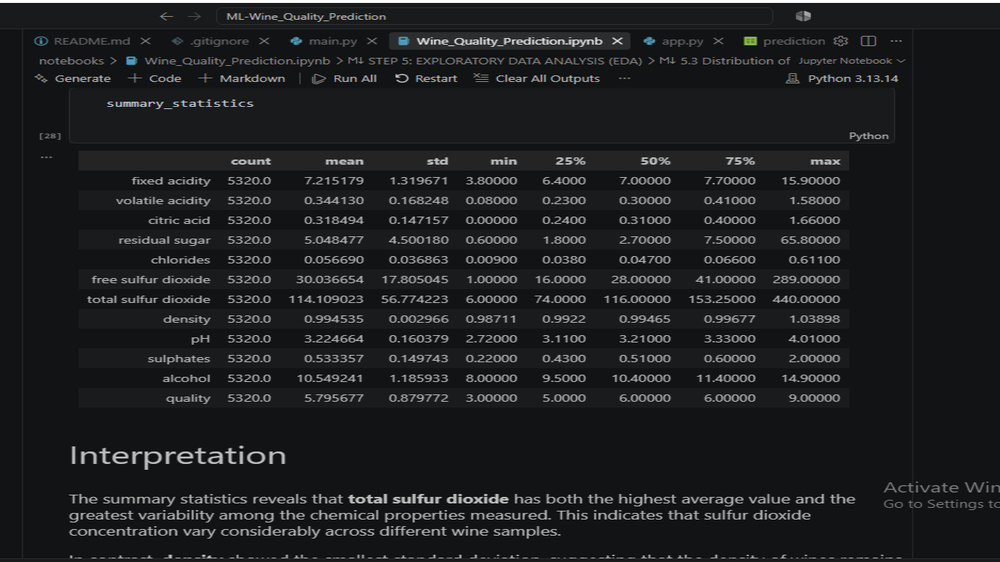

The summary statistics provide an overview of the distribution and descriptive characteristics of the wine-quality dataset.

### 2. Correlation Heatmap

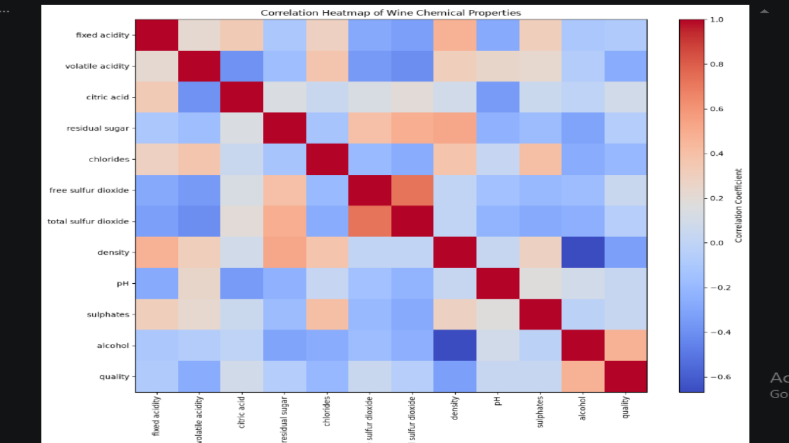

The correlation analysis shows the relationships between the physicochemical properties and wine quality. Alcohol showed the strongest positive relationship with wine quality, while density showed a weak negative relationship.

### 3. Model Comparison

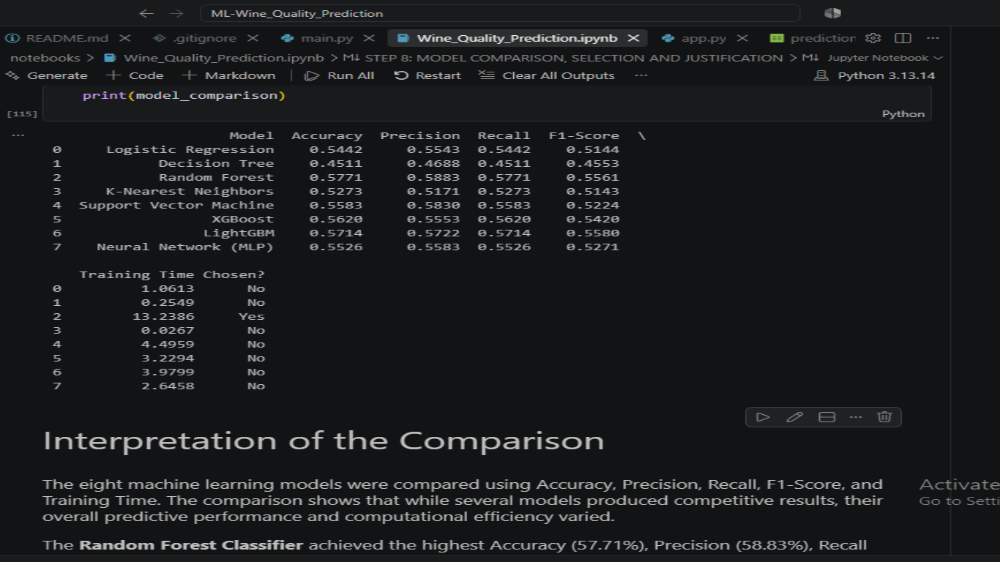

This comparison presents the evaluation results of the machine learning models considered during the project.

### 4. Final Model Ranking

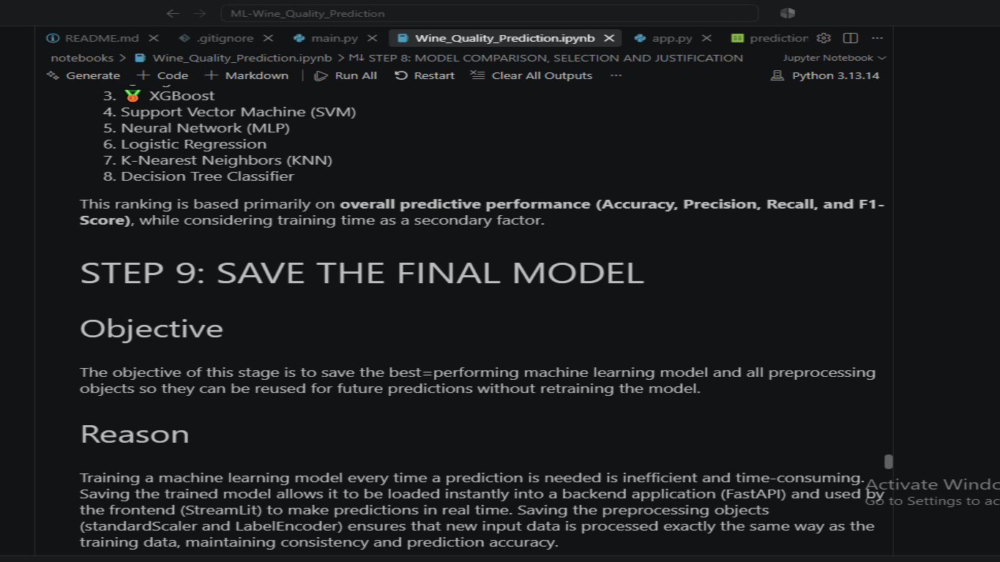

The final model ranking provides a comparative view of model performance and supports the selection of the final prediction model.

### 5. FastAPI Backend

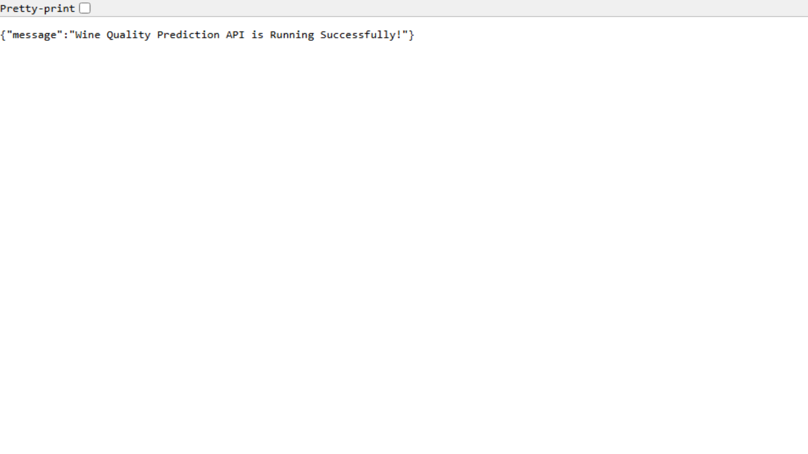

The FastAPI backend provides the API service responsible for receiving wine-property inputs and returning predictions from the trained machine learning model.

### 6. FastAPI Swagger Documentation

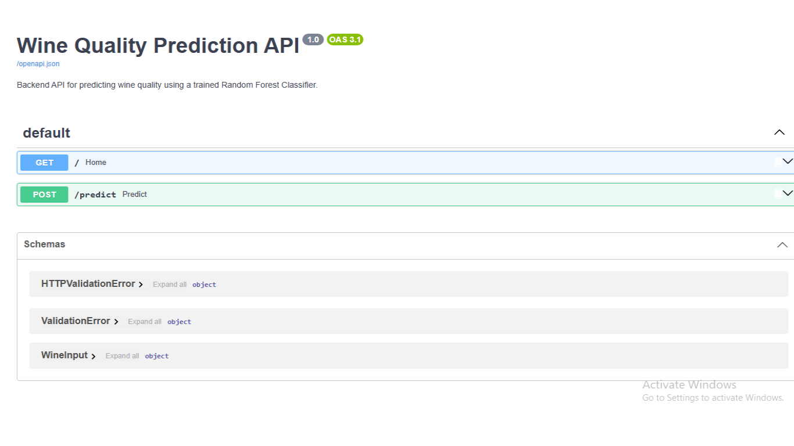

The Swagger interface provides interactive documentation and testing for the deployed FastAPI endpoints.

### 7. FastAPI Prediction

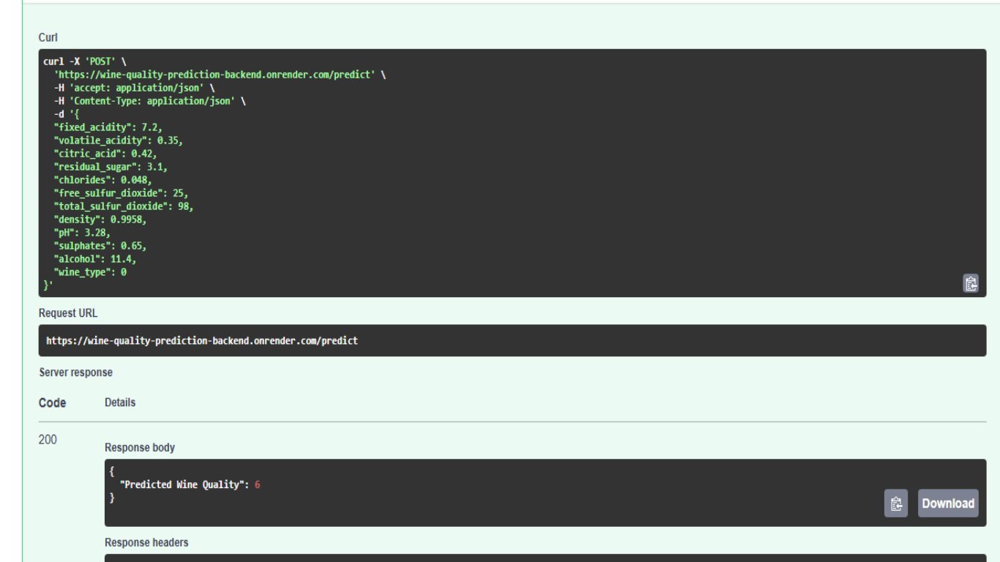

The deployed API successfully processed a prediction request and returned a wine quality prediction.

### 8. Streamlit Frontend

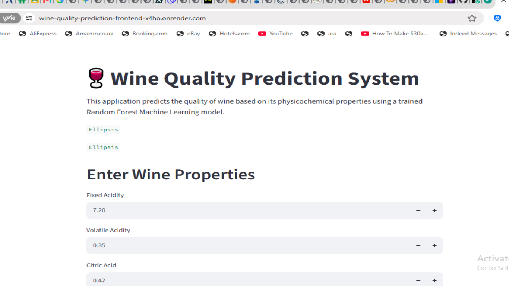

The Streamlit frontend provides a user-friendly interface for entering wine physicochemical properties and obtaining a predicted quality score.

### 9. Render Backend Deployment

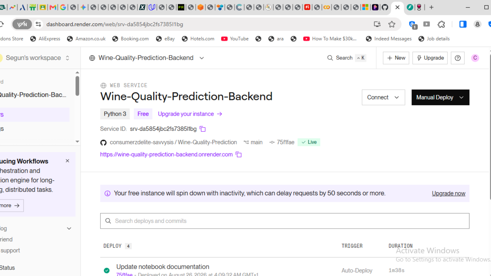

The FastAPI backend was successfully deployed as a live web service on Render.

### 10. Render Frontend Deployment

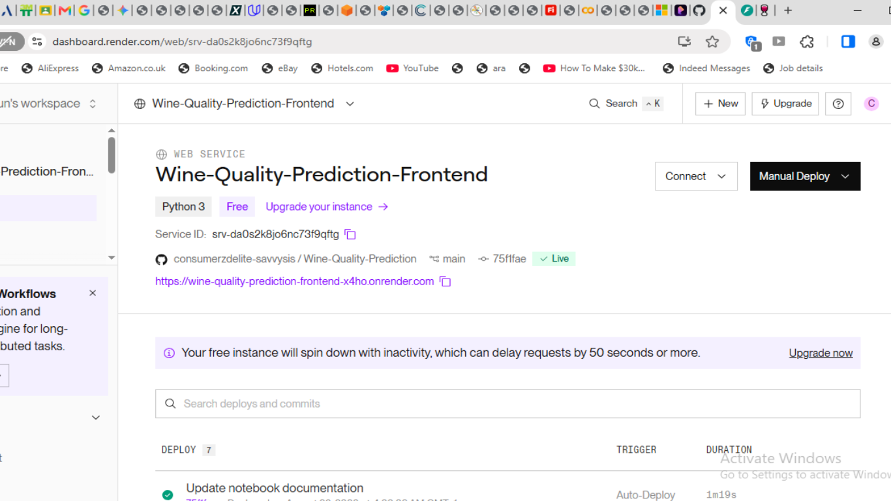

The Streamlit frontend was successfully deployed as a live web service on Render.

### 11. Final Prediction

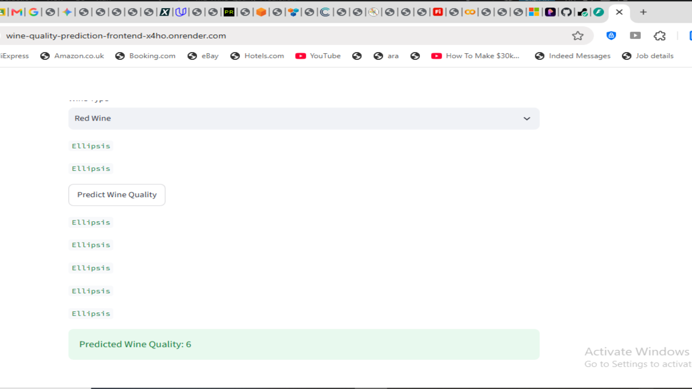

The deployed application successfully returned:

**Predicted Wine Quality: 6**

## Future Improvements

Potential future improvements include:

•	Comparing additional machine learning algorithms
•	More detailed model comparison
•	Improved handling of wine-quality classes
•	Explainable AI and advanced feature-importance analysis
•	Improved frontend design
•	Automated model retraining
•	Continuous integration and deployment
•	Enhanced monitoring of production predictions

## Author

**Name**: Segun Daramola

**Cohort**: Data Science / AI and Machine Learning Cohort 3

**Programme**: 3MTT/DSN/DeepTech/WesOnline Mentorship
---

## Mentor / Training Credit

**GworldSoft Solutions Limited / 3MTT (DSN/DeepTech_Ready/WesOnline)**
---

## Project Status

**Current Status**: Completed end-to-end Machine Learning solution with cloud deployment and successful remote validation.

The project currently includes:

-	Data preparation
-	Exploratory Data Analysis
-	Feature engineering
-	Data preprocessing
-	Random Forest model development
-	Random Forest model training
-	Model evaluation
-	Prediction
-	FastAPI backend
-	Streamlit frontend
-	Frontend–backend integration
-	Git/GitHub version control
-	Cloud deployment using Render
-	Remote API validation
-	Public Streamlit application

## Final Validation

The deployed application was successfully tested end-to-end.

Final result:

**Predicted Wine Quality: 6**

This confirms that the trained model, saved preprocessing scaler, FastAPI backend, Streamlit frontend, and cloud deployment are working together as an end-to-end prediction system.

## Live Application

**Streamlit Frontend**:
https://wine-quality-prediction-frontend-x4ho.onrender.com⁠

**FastAPI Backend**:
https://wine-quality-prediction-backend.onrender.com⁠

**FastAPI Swagger Documentation**:
https://wine-quality-prediction-backend.onrender.com/docs⁠

## Repository

The complete project source code, machine learning notebook, model artifacts, reports, screenshots, API, frontend, and documentation are maintained on GitHub:

https://github.com/consumerzdelite-savvysis/Wine-Quality-Prediction
